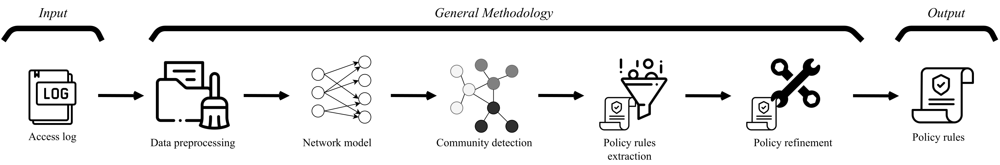
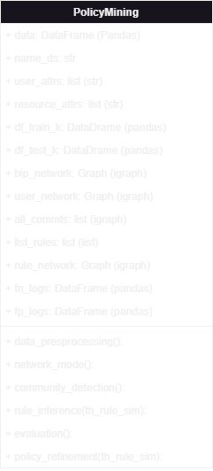

# ABAC Policies Mining by Complex Networks Analysis Techniques

## Overview

This repository contains the codes and data materials used for the publication titled "ABAC Policies Mining by Complex Networks Analysis Techniques". This paper has been published in [TBC-Journal]. It is available at [TBC-DOI]. The Authors are Daniel Díaz-Rodríguez and Arturo Diaz-Perez.

**Abstract**: Recent computing technologies and modern information systems require an access control model that provides flexibility, granularity, and dynamism. The attribute-based access control (ABAC) model was developed to solve the new challenges of emerging applications. Designing and implementing an ABAC policy manually is usually a complex and costly task, therefore, organizations prefer to keep their mechanisms in operation rather than be exposed to all the costs of the migration process.

A solution to the above is to automate the process of creating access control policies. This action is known as policy mining. In this paper, we present a novel approach, based on complex networks, for mining an ABAC policy from an access control log. The proposed approach is based on the data and the relationships that can be generated from them. The proposed methodology is divided into five phases:
1) Data preprocessing
2) Network model
3) Community detection
4) Policy rules extraction
5) Policy refinement.

The results show that it is possible to obtain an ABAC policy using the approach based on complex networks. In addition, our proposed methodology outperforms existing ABAC mining algorithms in terms of quality. Finally, we present a novel access decision process that reduces the number of rules to evaluate based on a rule network.




---

## Table of Content

- **[Repository Organization](#repository-organizaion)**

- **[Dependencies](#dependencies)**

- **[Data Availability Statement](#data-availability-statement)** 

- **[How to Use](#how-to-use)**

- **[License](#license)**

- **[Citation](#citation)**

---
## Repository Organizaion

The repository is organized as follows:
* ***00-Data/*** : This folder contains the data that will be used for the experiments of the methodology. The data is in *.csv* file format. It is necessary to rename the name of the access request decision column to "ACTION" and map its two possible values *permitted* and *denied* to *1* and *0*, respectively.
* ***01-Auxiliar Functions/*** : source code that contains the auxiliary functions of the presented methodology. The auxiliary functions are divided into files, named after each phase of the methodology, which corresponds to the call of the function in its respective phase.
* ***02-Outputs/*** : Folder where the results of the methodology are shown.
* ***main.py*** : script containing the complete execution methodology to extract the policy rules from a *csv* Dataset.
* ***policy_mining.py*** : script containing the *policy mining* class used for the main.py file. Figure X shows a simple description of attributes and methods of the class.



The class constructor requires:
* FILE_NAME: Address of the dataset.
* DATASET_NAME: Name of the dataset.
* USER_ATTRS: List of user attributes.
* RESOURCE_ATTRS: List of resource attributes.


---
## Dependencies
Python and libraries versions currently used:

| Library | Version | 
|----------|----------|
| python | 3.7.13 | 
| python-igraph | 0.9.9 | 
| networkX | 2.6.3 | 
| numpy | 1.21.5 | 
| pandas | 1.3.4 | 
| matplotlib | 3.5.1 | 

---

## Data Availability Statement

Publicly available datasets were analyzed in this study. This data can be found here:
* ***Healthcare (HC)*** https://www3.cs.stonybrook.edu/~stoller/software/index.html at https://doi.org/10.1007/978-3-662-43936-4_18.
* ***Amazon (AMZ)*** https://www.kaggle.com/datasets/lucamassaron/amazon-employee-access-challenge
* ***Connected and Autonomous Vehicles (CAV)*** https://github.com/dais-ita/CAVPolicyov

---
## How to Use

The execution of *main.py* script only receives as parameter the name of dataset. To execute our proposal in the Amazon dataset, we use AMZ as parameter (HC: healthcare, CAV: connected and autonomous vehicles):

```$ python main.py AMZ ```

The results are stored in the ```02-Outputs/``` directory.


---
## License

This survey publication and its supplementary materials are provided under the GNU GPL. Please review the LICENSE file for more details about the usage and distribution terms.

For any inquiries or assistance, please contact Daniel Díaz (hector.diaz@cinvestav.mx).

---
## Citation

If you find this survey publication or any of the supplementary materials useful in your work, please consider citing: